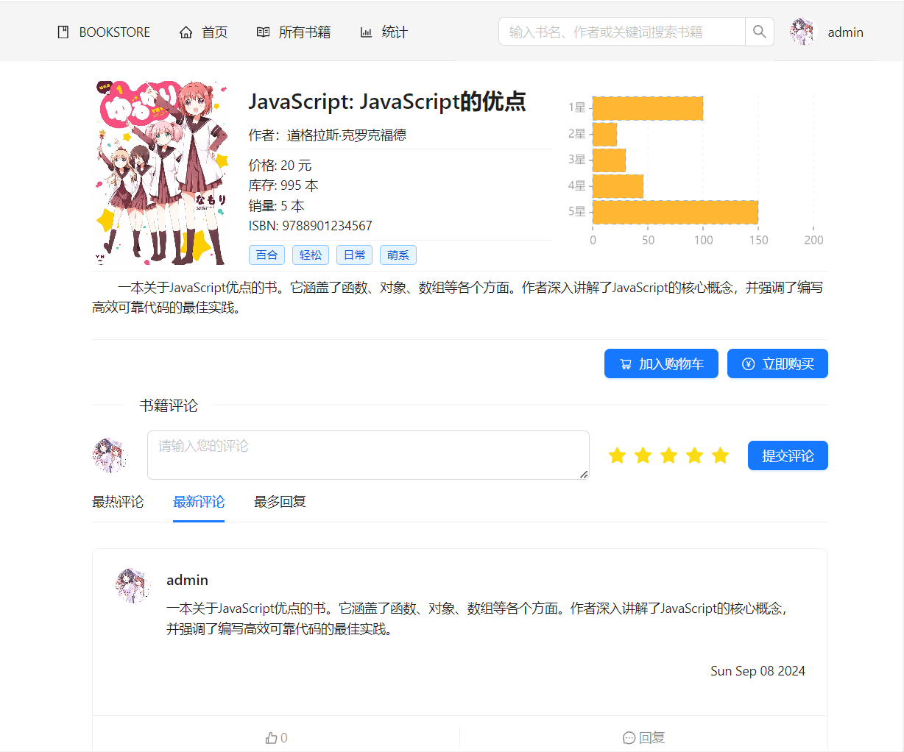
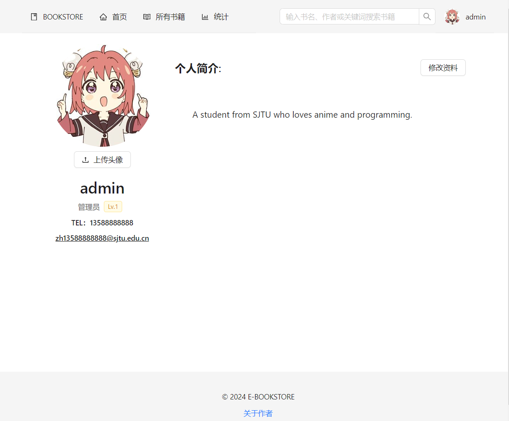

# E-Bookstore

此项目是个人制作的电子书店平台，前端使用 React+Vite 框架，后端使用 Spring Boot 框架与 MySQL 关系型数据库，UI 主要使用[Ant Design](https://github.com/ant-design/ant-design/)，支持电脑网页端。

界面与功能设计灵感来自于电子漫画网站[Kox.moe](https://mox.moe/)

## 预览

<p align="center">

</p>
<center>首页</center>
<br>
<p align="center">

</p>
<center>书籍浏览页</center>
<br>
<p align="center">

</p>
<center>书籍详情页</center>
<br>
<p align="center">

</p>
<center>数据统计页</center>
<br>
<p align="center">

</p>
<center>个人主页</center>
<br>

- 还具有**用户、订单、书籍管理**功能（管理员）与**购物车、搜索、评分评论**功能（顾客）

## 项目架构

- 前端：React+Vite 框架
- 后端：Spring Boot 框架
- 数据库：MySQL 关系型数据库

## 开始使用

### 前端

打开 frontend 文件夹

安装依赖

```bash
$ npm install
```

在本地环境运行前端 默认运行在 5173 端口

```bash
$ npm start
```

### 后端

建议使用 IDEA 打开 backend 文件夹 运行主类即可部署后端在本地环境 默认运行在 8080 端口

如需改变端口等环境变量 可以在 backend 下添加.env 文件覆盖默认参数

### 数据库

## 贡献者

- [关于 - nwdnysl](https://nwdnys1.github.io/about)
